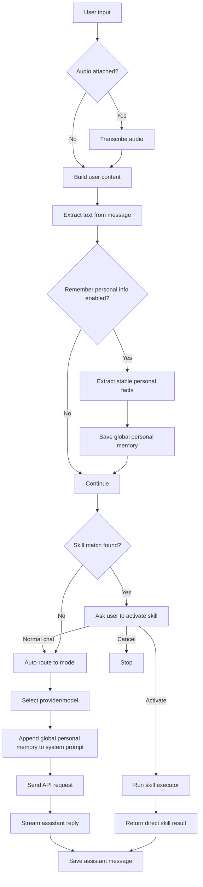

# genAI_hw1

A Streamlit-based multimodal personal chatbot with:

- multi-provider chat (`OpenAI`, `Gemini`, local OpenAI-compatible backends)
- automatic model routing
- transcript-first voice input
- global personal long-term memory
- session-based chat history
- skill-style request flows such as weather lookup

## What This Project Can Do

### Core chat

- Chat with hosted or local models through an OpenAI-compatible client
- Switch providers manually, or let the app auto-route per request
- Persist chat history in SQLite and reopen older sessions

### Multimodal input

- Send text-only messages
- Upload images alongside text
- Record voice or upload audio files
- Transcribe audio first, then use the transcript as the user message
- Optionally include the raw recording only when `Analyze the recording itself` is enabled

### Memory

- Save stable personal facts as **global long-term memory**
- Reuse those facts across future sessions
- Keep the current chat as **short-term/session memory**
- View and delete saved personal memory facts from the sidebar

### Skill flows

- Discover request-flow skills from `skills/request-flows/*/flow.json`
- Match a skill from config instead of hardcoding every skill path in Python
- Ask the user for permission before activating a matched skill
- Fall back to normal chat if the user declines skill activation

### Weather skill

- Detect weather-style requests
- Resolve user-specified locations when possible
- Fall back to IP-based location if none is given
- Handle current weather and tomorrow-style forecast questions
- Answer decision questions like `Do I need an umbrella tomorrow?` with an interpreted recommendation instead of raw numbers only

### Debugging and inspection

- Show the exact API payload sent to the selected model
- Show the last route decision
- Show which skill was activated or which model/provider handled the request

## How It Is Implemented

### Main stack

- UI: `Streamlit`
- LLM client: `openai.OpenAI`
- Storage: `SQLite`
- Environment/config: `.env` + sidebar controls

### Main file

The app logic lives in [main.py](/home/toshi-tuf/git-storage/genAI_hw1/main.py).

Key pieces:

- `load_request_flow_skills()`
  loads skill flow configs from the local `skills/request-flows/` directory
- `select_request_flow_skill(...)`
  chooses a matching skill from config
- `route_request(...)`
  performs model auto-routing when a skill is not used
- `transcribe_audio_file(...)`
  turns voice/audio input into text before normal chat handling
- `extract_personal_memories(...)`
  extracts stable user facts for global long-term memory
- `generate_model_reply(...)`
  builds the final prompt and streams the model response
- `lookup_weather(...)`
  handles direct weather/forecast lookup for the weather skill

### Data model

The project uses SQLite with two main storage concepts:

- `messages`
  stores chat history by `session_id`
- `long_term_memory`
  stores global personal memory facts with a scope marker

The current session is short-term memory because the app resends that session’s message history on each request. Personal facts are long-term memory because they are saved globally and injected into future chats.

### Long-term memory behavior

When `🧠 Remember personal info` is enabled:

1. The app extracts text from the current user message
2. It asks a small extraction model to return only stable personal facts
3. Those facts are saved to global personal memory
4. Before generating a reply, the app appends:

```text
### Global Personal Memory ###
- ...
- ...
```

to the system prompt

That means preferences like `I don't like Chinese food` can be reused across sessions.

### Skill flow behavior

Each skill flow lives under:

```text
skills/request-flows/<skill-name>/
```

For example:

```text
skills/request-flows/weather-request/
  SKILL.md
  flow.json
  references/
```

`flow.json` is used for runtime matching and activation behavior.

`SKILL.md` documents the intended logic, trigger patterns, and output rules.

The app currently has a built-in executor for the weather skill. The matching and approval are file-driven, but new skill types still need an executor implementation if they do something new.

## Running The Project

```bash
./startup.sh
```

This script:

1. creates a virtual environment if needed
2. installs dependencies
3. launches the Streamlit app

## Typical User Flow

### Normal chat

1. User types a message
2. App checks whether a request-flow skill matches
3. If no skill is chosen, the app auto-routes the request to a model
4. Global personal memory is appended to the system prompt
5. The selected model generates the reply

### Voice input

1. User records audio or uploads an audio file
2. App transcribes it first
3. Transcript becomes the user message
4. Optional raw audio can also be attached only in analysis mode
5. The request continues through skill matching or normal model routing

### Skill activation

1. User asks something that matches a skill flow
2. App shows an activation prompt
3. User can:
   - activate the skill
   - use normal chat instead
   - cancel
4. If activated, the skill executor runs directly

## Flowchart



## Example Behaviors

### Cross-session personal memory

Session A:

```text
I don't like Chinese food.
```

Later, Session B:

```text
What food don't I like?
```

The app can answer from global personal memory, even though the session changed.

### Weather skill

```text
How's the weather in Hsinchu?
```

The app should:

- match the weather skill
- ask permission to activate it
- resolve `Hsinchu`
- return weather for Hsinchu instead of falling back to IP location

### Umbrella recommendation

```text
Do I need an umbrella tomorrow?
```

The weather flow should:

- detect a tomorrow forecast request
- fetch forecast data, not current-only weather
- interpret precipitation signals
- answer with `Yes`, `No`, or a qualified recommendation

## Current Limitations

- Skill matching is config-driven, but execution still needs a built-in executor per skill type
- Audio transcription currently depends on an OpenAI route and a valid transcription model
- Weather lookup is implemented with built-in HTTP calls because the app runtime does not currently expose a real MCP server/tool interface
- The weather flow is much better for direct weather questions than for broad travel-planning conversations
